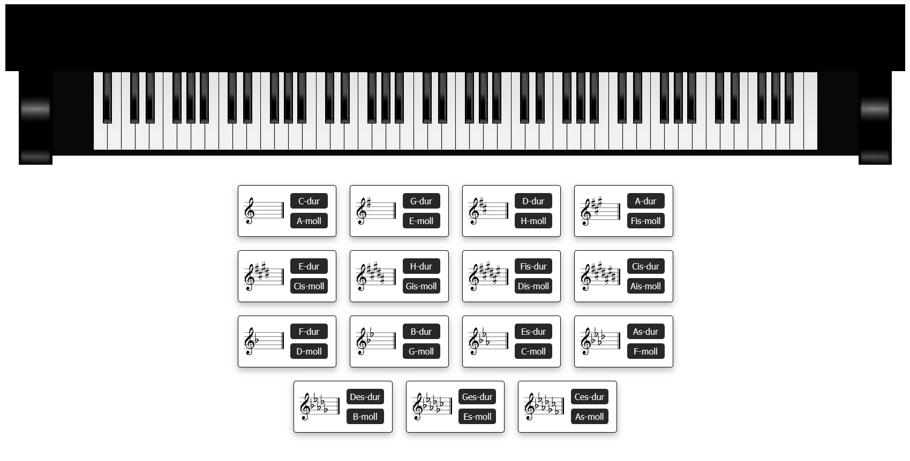

# Piano
This is a simple web page where you can play piano using all 88 keys. It also gives the opportunity to listen to major and minor scales.

## Technologies
Project is created with:
* HTML 5
* CSS 3
* JavaScript

## Screenshot

    

